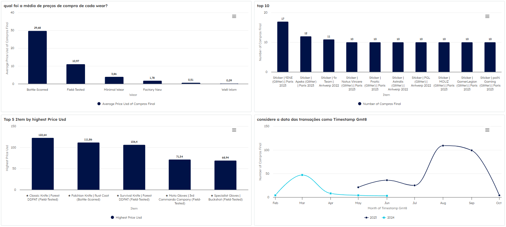
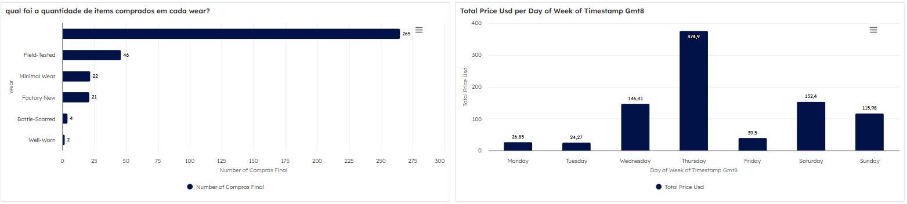

# Ingestão e Transformação de Dados de Compras - CS2 Buff.163

Pipeline de dados desenvolvido com **Apache Airflow** para processar compras do jogo CS2 realizadas no finado (saudades) marketplace **Buff.163**. O pipeline executa as etapas de ingestão, transformação, conversão de moeda e carregamento final no **BigQuery**. Os dados então são explorados para obtenção de insights no **Veezoo**.

---

## Visão Geral do Pipeline

1. **Extração**: Arquivo `.csv` com os dados de compras é armazenado no Google Cloud Storage.
2. **Transformação**: Tratamento dos dados.
3. **Conversão de Moeda**: Preço em CNY é convertido para USD com base na taxa diária obtida via API.
4. **Carga**: Dados tratados são carregados no Google BigQuery.
5. **Exploração**: Os dados são utilizados para dashboards e exploração em linguagem natural com o Veezoo.

---

## Dashboards no Veezoo

Abaixo, alguns exemplos dos dashboardsconstruídos a partir dos dados no Veezoo:

---

## Tecnologias Utilizadas

- [Apache Airflow](https://airflow.apache.org/)
- [Google Cloud Storage (GCS)](https://cloud.google.com/storage)
- [Google BigQuery](https://cloud.google.com/bigquery)
- [Pandas](https://pandas.pydata.org/)
- [Frankfurter API](https://www.frankfurter.app/)
- [Veezoo](https://www.veezoo.com/)

---
